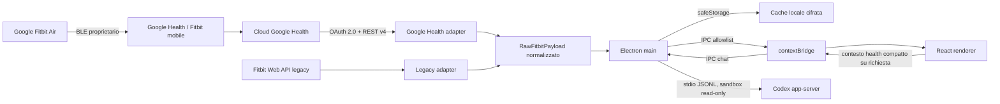

# Architettura

## Obiettivi

- UI desktop veloce e utilizzabile anche senza account tramite dataset demo.
- Google Health API v4 come provider principale, Fitbit Web API come fallback isolato.
- Nessun token o secret nel renderer.
- Consenso parziale e sensori assenti non devono bloccare la dashboard.
- Archivio health cifrato per singolo giorno e nessun upload verso servizi Pulseboard; i giorni conclusi vengono letti localmente senza nuove richieste al provider. Se `safeStorage` non è disponibile o Linux seleziona il backend non cifrato `basic_text`, il salvataggio fallisce in modo esplicito.
- Normalizzazione unica, così le viste non conoscono la forma delle API remote.
- Chat opzionale via Codex app-server: nessuna API key nel progetto e nessun dato health inviato finché l'utente non manda un messaggio.

## Flusso



## Confini di sicurezza

### Processo main

È l’unico autorizzato a:

- aprire il server loopback OAuth;
- conoscere Client Secret, access token e refresh token;
- chiamare `health.googleapis.com` e `api.fitbit.com`;
- leggere e scrivere cache e credenziali;
- aprire URL esterni ed esportare file su richiesta esplicita.
- avviare Codex app-server e inoltrare esclusivamente il contesto health compatto preparato per il turno.

### Preload

Espone una allowlist di operazioni con `contextBridge`. Non espone Node, filesystem, `ipcRenderer` generico o token. Gli eventi chat sono limitati a stato, delta testuali, completamento, errore e cancellazione.

### Renderer

Funziona con `nodeIntegration: false`, `contextIsolation: true` e sandbox. Riceve stato pubblico e payload salute privi di credenziali; normalizza e compatta le sole metriche necessarie prima di un turno Codex.

### Codex bridge

`codex-service.cjs` risolve l'eseguibile installato da Codex Desktop, apre `codex app-server` su stdio e riusa l'autenticazione locale. Ogni thread usa `read-only`, `approvalPolicy: never` e rete disabilitata per i tool. Richieste di shell, patch, permessi, input o tool vengono negate dal client. Le credenziali OAuth Fitbit/Google non entrano mai nel contesto del modello.

## Provider contract

Ogni adapter implementa:

```text
createPkce()
createAuthorizationUrl(config, state, pkce)
exchangeAuthorizationCode(config, code, verifier)
refreshAccessToken(config, token)
revokeToken(token)
syncData(accessToken, date, onProgress)
```

Il main seleziona l’adapter in base a `config.provider`. La UI riceve sempre lo stesso contratto `RawFitbitPayload`, poi `normalizeFitbitData` lo converte in `DashboardData`.

## Resilienza

- Le letture API sono indipendenti: una risposta 403/404 per ECG o temperatura non annulla passi e sonno.
- Ogni errore viene associato alla sorgente e mostrato nella pagina Dispositivi.
- Google Health viene limitato a meno di 5 richieste al secondo; il `429` riceve un retry con backoff.
- Il token viene aggiornato prima della scadenza; i refresh token ruotati vengono salvati atomicamente.
- Le scritture cifrate passano da file temporaneo + rename per evitare cache parziali.
- Una sync quasi interamente fallita non sostituisce l’ultima cache valida e le sync concorrenti vengono serializzate.

## Decisioni deliberate

1. **Niente BLE reverse-engineered.** Non è un’interfaccia supportata e renderebbe pairing e dati fragili o insicuri.
2. **Browser di sistema per OAuth.** Nessuna password Google/Fitbit attraversa Electron.
3. **Dual provider.** È la strategia di migrazione raccomandata da Google; il renderer non contiene branching API.
4. **Demo first.** Lo sviluppo visuale e i test non richiedono dati salute reali.
5. **Read-only scopes.** Pulseboard non modifica il profilo sanitario dell’utente.

## Nota per una distribuzione pubblica

Il client Google Health documentato è di tipo Web e usa un Client Secret. `safeStorage` lo protegge sul computer, ma un secret distribuito dentro un’app desktop non è un vero segreto globale. Per distribuire Pulseboard a terzi, spostare lo scambio OAuth su un backend minimale, completare la verifica Google e la security review richiesta. La configurazione attuale è appropriata per uso personale e sviluppo.
